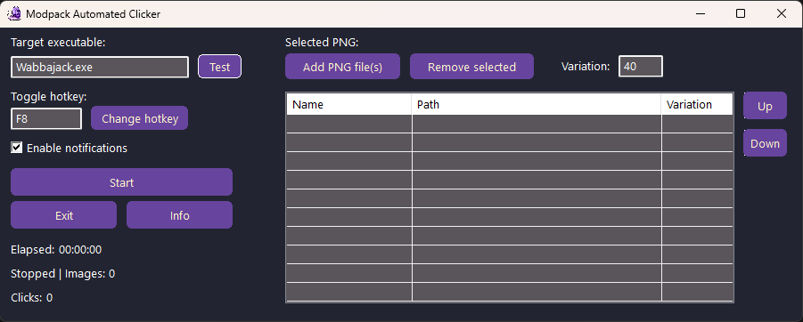

# Modlist Automated Clicker (MAC)

<p align="center">
  
</p>

**Modlist Automated Clicker (MAC)** is a small Windows utility that automatically detects predefined PNG images inside a target application window and clicks them when they appear.

It is designed as a lightweight helper for repetitive UI interaction, with configurable image priority, variation tolerance, hotkey control, notifications, and built-in safety checks.

## Screenshot



## Overview

So, you're browsing Wabbajack, looking for modlists for your favorite game. You open one, check its page, maybe read some reviews and decide to give it a try. You start the download and then it dawns on you - you will have to click through every single mod and there's A LOT of them. 
A couple hundred, maybe thousand. It will take you AGES. You start looking for alternatives. Maybe you can pay for premium account to streamline the process? Sure, but then you'll be stuck with yet another subscription fee and who needs that? Plus, that modlist may turn out to be a complete waste. 

Does that sound like you? 
If so, Modlist Automated Clicker (MAC) might be just the thing you need.

It's a very simple tool, really. All you need to do is to open it, take some screenshots of the download button(s), add them in and hit start. After that, sit back and enjoy as MAC does all the clicking for you. 

Of course, there are two main caveats. 
First - it will snatch the mouse more zealously than your sibling during hotseat session. You won't be able to do any work while it's doing its job, so leave it be. Maybe listen to your favorite music or watch some movie on the other screen (just make sure it doesn't have any Download buttons in it).
Second - while it will simultaneously decrease completion time and your chances of getting Carpal tunnel syndrome, it still won't improve the download speed itself. 

MAC has been created using AutoHotkey, but is distributed as a compiled `.exe`, so it can be launched directly on Windows without the need of installing AutoHotkey on your machine. Still, if you'd like to use it in the script form or modify it, feel free to grab a copy from the source folder.

## Functionality

- Monitor a target application by executable name.
- Add one or multiple PNG files in a single action.
- Assign a variation value used during image matching.
- Reorder PNGs with **Up** and **Down** buttons to control search priority.
- Configure the time interval between search cycles.
- Start and stop scanning from the GUI.
- Use a configurable toggle hotkey.
- Show current status, elapsed time, image count, and total click count.
- Enable or disable popup notifications.
- Validate the selected target window before running.
- Save configuration automatically to an `.ini` file on start, stop, and exit.
- Restore saved configuration automatically on the next launch.

## How to use

1. Launch `Modlist Automated Clicker.exe`.
2. In **Target executable**, enter the executable name of the program you want MAC to monitor, for example:
   ```text
   Wabbajack.exe
   ```
3. Set or change the toggle hotkey if needed.
4. Set the default image **Variation** value.
5. Set the **Search interval (ms)** value.
6. Click **Add PNG file(s)** and select one or more PNG references.
7. Use **Up** and **Down** to adjust PNG priority order.
8. Optional - test the target before starting. If it detects a window, but it's not active, don't worry - it'll become active upon start.
9. Press **Start** to begin scanning.
10. Keep the target window active while MAC is running.

## Notes

- PNGs are checked in top-to-bottom order, so the higher in the list it is, the higher priority it gets.
- Lowering search interval value makes detection more responsive, but it may increase CPU usage.
- Increasing search interval value reduces CPU usage, but may delay detection slightly.
- Variation controls how much visual difference is allowed when matching an image.
- For best results, use tightly cropped PNGs that contain only the clickable download button.
- MAC checks whether the target window is active before scanning; a visible window is not always the same as the active window.

## Disclaimer

Use MAC only where UI automation is allowed.  
Some applications, launchers, or services may restrict or prohibit automated interaction.
This tool is not affiliated nor endorsed by The Wabbajack Team, Bethesda Softworks or Sheogorath the Daedric Prince of Madness.
